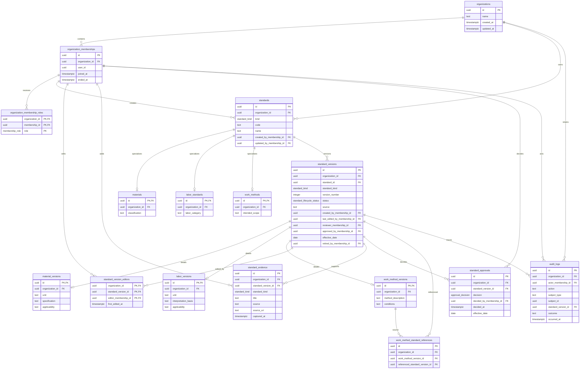

# Standards Workspace Data Model

Phase 1B models organization-scoped Material, Labor, and Work Method standards.
`standards` and `standard_versions` hold shared identity and governance fields;
the kind-specific tables hold only category content.

All cross-table references include `organization_id`. The only table without it
is `organizations`, which is the tenant root rather than an organization-owned
business record.
